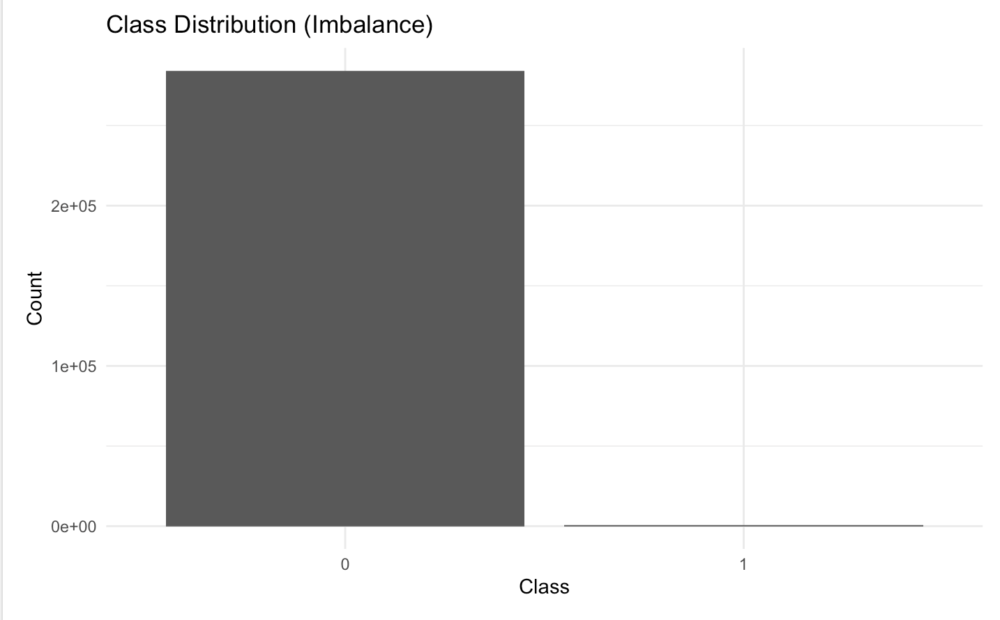
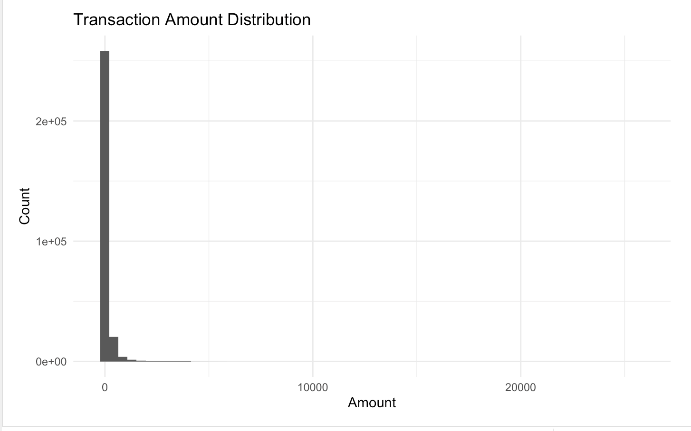
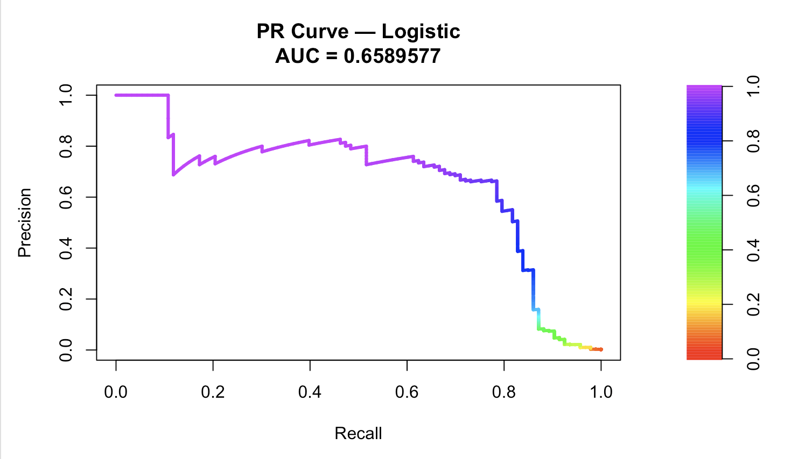
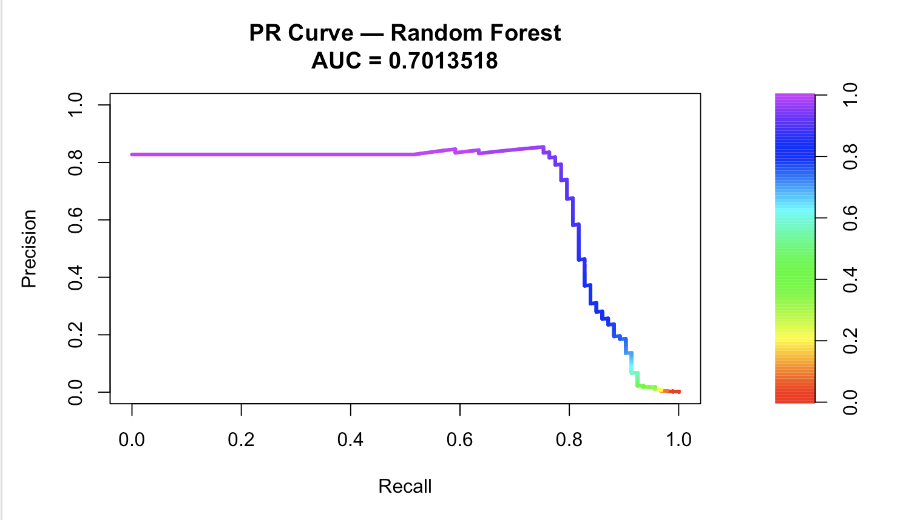
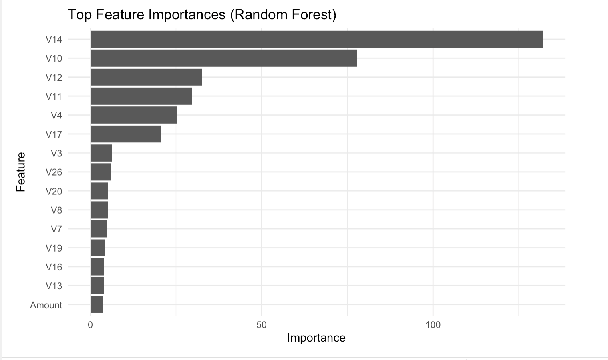

# 💳 Credit Card Fraud Detection

Machine learning project that detects fraudulent credit card transactions using **Logistic Regression** and **Random Forest** models built with **R** and the **tidymodels** framework.

🌐 **Live Demo:** https://dillyy1109.github.io/credit-fraud-detection/

📄 **Interactive Report:** https://dillyy1109.github.io/credit-fraud-detection/creditfrauddetection.html

---

# Project Overview

Credit card fraud is a highly imbalanced classification problem where fraudulent transactions account for only a tiny fraction of all observations. In this setting, traditional accuracy can be misleading because a model can achieve high accuracy while failing to detect fraudulent transactions.

This project develops and compares two machine learning models—**Logistic Regression** and **Random Forest**—to identify fraudulent credit card transactions. The models are evaluated using metrics that are more appropriate for imbalanced datasets, with **Precision-Recall AUC (PR AUC)** serving as the primary evaluation metric.

---

# Project Highlights

- Built an end-to-end machine learning pipeline in **R**
- Compared **Logistic Regression** and **Random Forest**
- Addressed severe class imbalance using **downsampling**
- Tuned the classification threshold to maximize **F1 Score**
- Evaluated models using **Precision-Recall AUC**, ROC AUC, Precision, Recall, and F1 Score
- Analyzed feature importance to identify key predictors of fraud

---

# Dataset

**Credit Card Fraud Detection Dataset**

- European credit card transactions
- Binary classification problem

Target variable:

- **0** → Legitimate transaction
- **1** → Fraudulent transaction

The dataset is highly imbalanced, making fraud detection significantly more challenging than standard classification tasks.

> **Note:** The dataset is not included in this repository due to licensing and size restrictions.

## Class Distribution



*Figure 1. Fraudulent transactions represent only a very small proportion of the dataset, illustrating the severe class imbalance.*

## Transaction Amount Distribution



*Figure 2. Most transactions involve relatively small amounts, while a small number of high-value transactions create a heavily right-skewed distribution.*

---

# Tech Stack

### Programming Language

- R

### Libraries

- tidymodels
- ranger
- glmnet
- dplyr
- ggplot2

### Machine Learning Models

- Logistic Regression
- Random Forest

---

# Methodology

## Data Preparation

- Stratified 80/20 train-test split
- Feature normalization
- Downsampling of the majority class (training data only)

## Model Development

Two supervised learning models were trained and compared:

### Logistic Regression

- Baseline linear classification model
- Regularized using **glmnet**

### Random Forest

- Ensemble tree-based classification model
- Implemented using **ranger**

## Model Evaluation

Because fraud detection involves highly imbalanced data, the following evaluation metrics were used:

- Precision-Recall AUC (Primary Metric)
- ROC AUC
- Precision
- Recall
- F1 Score

The classification threshold was optimized using the validation set to maximize the F1 Score.

---

# Results

The **Random Forest** model achieved better performance than Logistic Regression on the primary evaluation metric, **Precision-Recall AUC**, demonstrating stronger ability to identify fraudulent transactions.

## Model Comparison

| Model | PR AUC |
|--------|--------:|
| Logistic Regression | 0.659 |
| Random Forest | **0.701** |

---

## Logistic Regression Performance



*Figure 3. Precision-Recall curve for the Logistic Regression model (PR AUC = 0.659).*

---

## Random Forest Performance



*Figure 4. Precision-Recall curve for the Random Forest model (PR AUC = 0.701). The Random Forest achieved stronger overall performance on this highly imbalanced dataset.*

---

## Random Forest Feature Importance



*Figure 5. Random Forest feature importance. Variables **V14**, **V10**, and **V12** were identified as the most influential predictors of fraudulent transactions.*

---

# Key Findings

- Random Forest outperformed Logistic Regression on Precision-Recall AUC.
- Downsampling improved the model's ability to identify rare fraud cases.
- V14, V10, and V12 were the strongest predictors of fraudulent transactions.
- Precision-Recall AUC provided a more meaningful evaluation than accuracy due to severe class imbalance.

---

# Business Impact

Fraud detection systems operate on highly imbalanced datasets where missing fraudulent transactions can result in substantial financial losses. This project demonstrates how selecting appropriate evaluation metrics and machine learning techniques can improve fraud detection performance while reducing reliance on misleading accuracy metrics.

---

# Repository Structure

```text
credit-fraud-detection/
│
├── README.md
├── creditfrauddetection.Rmd
├── creditfrauddetection.html
│
└── images/
    ├── class_distribution.png
    ├── transaction_amount_distribution.png
    ├── pr_curve_logistic.png
    ├── pr_curve_random_forest.png
    └── feature_importance.png
```

---

# Future Improvements

Potential enhancements include:

- Apply SMOTE instead of random downsampling
- Implement XGBoost and LightGBM
- Perform hyperparameter tuning
- Explore cost-sensitive learning
- Evaluate probability calibration
- Deploy the model using Shiny

---

# Skills Demonstrated

- Machine Learning
- Fraud Detection
- Predictive Modeling
- Classification
- Data Preprocessing
- Model Evaluation
- Feature Importance Analysis
- Data Visualization
- R Programming
- tidymodels

---

# About Me

**Dilly Nguyen**

Data Science student at DePaul University with interests in machine learning, predictive analytics, and risk modeling.

- LinkedIn: https://linkedin.com/in/dilly1109
- GitHub: https://github.com/dillyy1109

If you found this project interesting, feel free to connect with me or explore my other machine learning projects.
